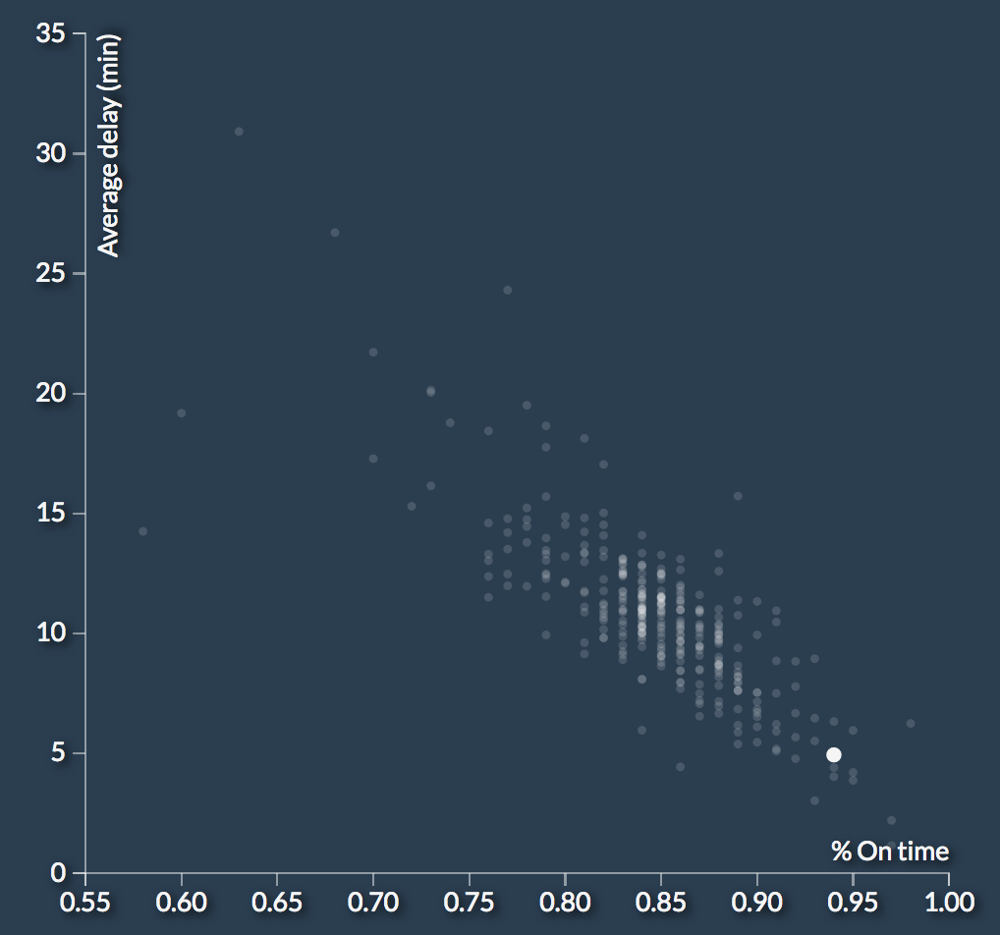
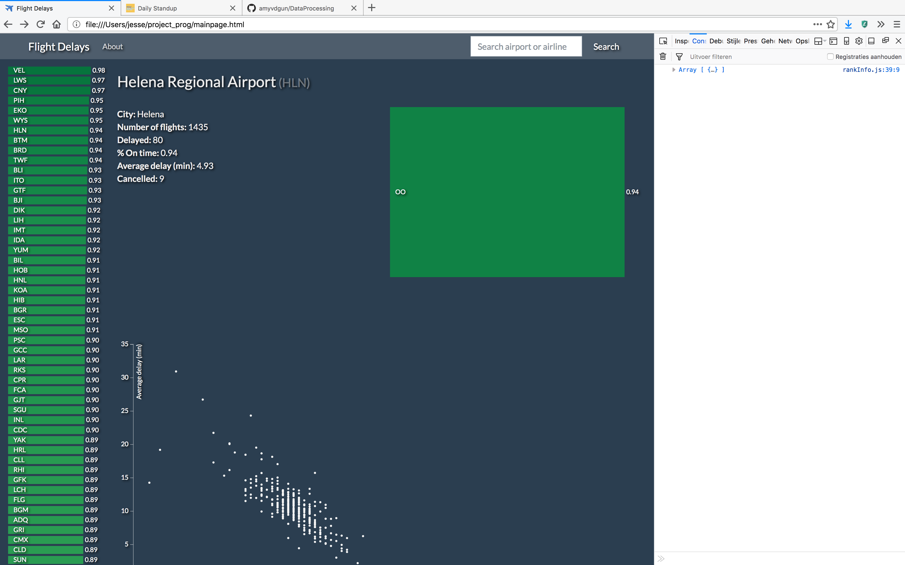

# Process book

## Week 1

### 4-06-2017

* Found dataset on Kaggle - Flight Delays.
* Sketch

### 5-06-2017

* Design document: dataset is too big, so will have to take extra preprocessing steps beforehand to be able to handle all the data. Individual flight data will be aggregated to airline and airport level.
* Think of extra interactive element on the page: search bar & dropdown / toggle menu.
* Made basic design diagram.

### 6-06-2017

* Design document: write code structure & function ideas.
* Start with writing the aggregate.py file that will preprocess the raw data downloaded from Kaggle.

### 7-06-2017

* Write aggregator script: read airport, airline and flight files as dicts, create new dict object and DictWriter to write new csv files with aggregated data.
* Continued writing aggregator script for airports.
* New insight: need seperate week and month files for the week/month filtering. I might just save these as seperate columns for both airports and airlines but will take 7 + 12 extra columns.
* Extra work for the day/month columns would only have to be done once because code structure for airlines.

* and it goes on and on... for every week / month

### 8-06-2017

* presentatie plannen

## Week 2

### 11-06-2017

* Continued writing aggregator script. Ran into a bug early: only one row of the airports was written correctly, the rest was kept 0 for some reason.
* Bug fixed: csv reader needed to be reset to the start of the flights file for every loop in airports. Now I just need to let the code run (overnight?), and write the same code format for airlines.
* Working further on the layout of the page. Picked a dark Bootswatch theme, added a navbar with search box.
* Finished running the scripts for data aggregation: now have two new data files.
* Airline data

* Airport data

### 12-06-2017

* Standard layout plan.

* Plans: write a data loader script and (hopefully) finish making the bar chart rankings of flights.
* Found out that when counting the number of flights on all airports i'm 'short' about 500.000 flights. That means that either there are 500.000 flights that were diverted and landed in the U.S. OR something went wrong in running the script OR there is some other technical explaination. However, I still think I have a representative sample of flights to use for visualisation.
* Found out that for most rows more than half of the flights are counted as delayed. This makes sense because in my script a flight counts as a delay when it departs one minute or more after scheduled departure time. Guidelines from the Federal Aviation Administration (FAA) define less strict definition of a delay; **the FAA consideres a flight delayed when it departs more than 15 minutes after the scheduled departure time** (https://en.wikipedia.org/wiki/Flight_cancellation_and_delay).
* I have to run the scripts again tonight with these new settings.
* To use the methods I'm most fimiliar with convert CSV files to JSON.

### 13-06-2017

* Now that the data is finished with the proper delay parameters, I started making the sidebar vis.
* The sidebar needs to be seperate from the navbar, but still scrollable so that the rest of the page is fixed.
* To avoid overlap between Bootstrap and manual CSS, I want to style my webpage with Bootstrap only.
* Started using the Bootstrap grid system to make the seperate parts of the page. I'm still not sure how to make the sidebar so that: it doesn't scroll OVER the navbar, ONLY the sidebar is scrollable and it's height/lenght is the COMPLETE page (minus the navbar).
* So far I achieved this:

* Once the sidebar is positioned correctly I need to: add a tooltip, highlight the bar on mouseover and add functionality to interact with the main page.

### 14-06-2017

* Finish scrolling issues. Sidebar is now very close to how I want it but needs some extra tweaking.

* Divided the dashboard into 4 divs.
* Started writing new scripts for: 1) text info, 2) scatter plot, 3) top locations/airlines, 4) weekly / monthly breakdown (in order of priority). 

### 15-06-2017

* Settled on dividing the dashboard into four equal parts (for now). Now prioritizing making the visualizations.
* Implemented onclick handler for side bar.
* Implemented interactive text info div.

* Started writing scatter plot script, which will fall in the the same onclick handler for the side bar (like every vis).

## Week 3

### 18-06-2017

**Plans for the week**
* Monday: Finish scatter plot
* Tuesday: Make bar charts
* Wednesday: Make week/month line graph + button
* Thursday: Search bar + autocomplete
* Friday: Finish up whatever is left & styling
* Finished writing the scatter and updates. Only minor bug left.
* For the rankings for every airport and every airline, I need to write another script that writes a json file.

### 19-06-2017

* Finished scatter yesterday + interactivity with the sidebar.

* Had to run a script to generate a new data set that tracks flights and delays at a lower level.
* Started working on both the third and fourth vis. While working on the fourth (the breakdown per day of the week / month) I noticed a bug in my initial data file: all october months are empty and I haven't found the source of that bug yet. To get fully correct data I will need to debug and run the script again, but I choose to prioritize finishing the visualisations.
* Another thing I am struggling with is getting the data in the correct format for the day/month vis.

### 20-06-2017

* While working on the new bar charts showing the rankings (airlines for every airports), I ran into a problem: I only aggregated data for the airlines that fly from the selected airport. This means in some cases, there are only one or two airlines per airport. This is not ideal because then only one or two bars can be drawn which looks ugly, and leads to update functions not working. I now have to run data scripts in python again to fix this issue.
* Ran into another data hiccup for the final vis but this can be solved in Javascript.
* Apart from the data, I still need to make a toggle button for the sidebar and for the week/month view, and a functional search bar. It's still a lot of work so I hope the data processing part won't take too much time.

### 21-06-2017

### 22-06-2017

## Week 4

### 25-06-2017

### 26-06-2017

### 27-06-2017

### 28-06-2017

### 29-06-2017