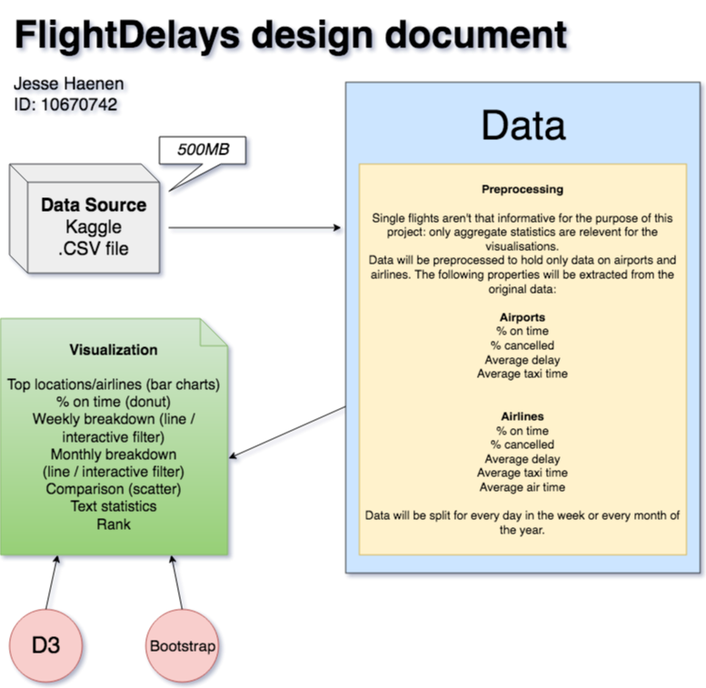

# Process book

## Week 1

### 4-06-2017

* Found dataset on Kaggle - Flight Delays.
* Sketch

### 5-06-2017

* Design document: dataset is too big, so will have to take extra preprocessing steps beforehand to be able to handle all the data. Individual flight data will be aggregated to airline and airport level.
* Think of extra interactive element on the page: search bar & dropdown / toggle menu.
* Made basic design diagram.

### 6-06-2017

* Design document: write code structure & function ideas.
* Start with writing the aggregate.py file that will preprocess the raw data downloaded from Kaggle.

### 7-06-2017

* Write aggregator script: read airport, airline and flight files as dicts, create new dict object and DictWriter to write new csv files with aggregated data.
* Continued writing aggregator script for airports.
* New insight: need seperate week and month files for the week/month filtering. I might just save these as seperate columns for both airports and airlines but will take 7 + 12 extra columns.
* Extra work for the day/month columns would only have to be done once because code structure for airlines.

* and it goes on and on... for every week / month

### 8-06-2017

## Week 2

### 11-06-2017

### 12-06-2017

### 13-06-2017

### 14-06-2017

### 15-06-2017

## Week 3

### 18-06-2017

### 19-06-2017

### 20-06-2017

### 21-06-2017

### 22-06-2017

## Week 4

### 25-06-2017

### 26-06-2017

### 27-06-2017

### 28-06-2017

### 29-06-2017