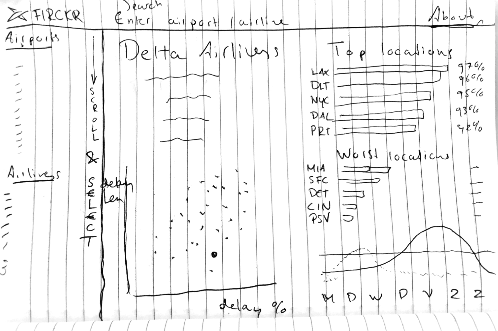

# H2 Final Project Minor Programming

Name: Jesse Haenen

ID: 10670742

# Flight Delays

> Nobody likes delays, so why not avoid airlines who are habitual latecomers?

## Problem Statement

Many people experience flight delays or cancellations at some point in their lives, and that's never fun. The purpose of the visialization is to help people avoid (or pick) airlines based on their track record, or to pick airports that have a relatively low amount of delays. This way people can help plan their trip a little better. The target audience of this project will be anyone flying on US domestic flights that want to avoid delays and fly happily.

## Solution

### Summary

This project will attempt to visualize delays and cancellations of US flights.

### Main features

* Enter airline or airport in search bar (interactivity) and visualize delay/cancellation rates and lenght, and compare with other airlines/airports (scatter). Plot will show a scatter of the average lenght of a delay versus the percentage of flights that are delayed. (MVP)
* Delays by day/month. When is the best time to fly (line) ? This will be the second interactive element (toggle/dropdown) to switch between week/month view.  (MVP)
* Rank aiports and airlines based on delay/cancellation rates and average delay lenght (bar). (MVP)
* Rank by average taxi time.
* Other statistics summarized in a short piece of text, such as max delay in 2015, average flight lenght etc.

## Prerequisites

### Data source

https://www.kaggle.com/usdot/flight-delays

### External components

Because the flights dataset is over 500MB, loading the entire set in the browser will be even worse then a delayed flight. I will preprocess the data to hold aggregated statistics per airport and airline.

Visualisations will be made with **D3**, page styling will be done with **Bootstrap**.

## Sketch

